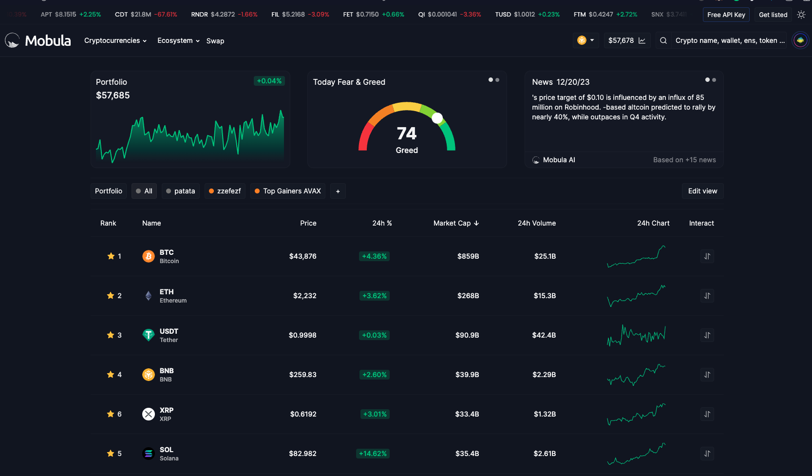

[](https://twitter.com/mobulaio)
[](https://discord.gg/hWVCP4J4e2)
 
 
 
<br />
Mobula is built using a modern tech stack comprising Next.js 13, Tailwind CSS, PostgREST, TypeScript and relies on npm for package management.
This documentation provides an overview of the setup process and outlines the project's folder structure and the role of each component within the architecture.
<br />
<br />

Check it out live: https://mobula.io
<br />


## Getting Started with Development
You can follow these instructions to set up your environment and start contributing to Mobula.

## Installing Dependencies
To install the necessary dependencies, run the following command in your terminal:
<br />
```bash
npm install
```
This will fetch and install all the packages required to run Mobula locally.

## Running Locally
To start the development server, execute:
<br />
```bash
npm run dev
```
This will start the server on a local port, typically http://localhost:3000, where you can view and test your changes in real-time.

## Folder Structure

### App
- **Purpose**: Contains the router configuration for the application.
- **Details**: Manages routing and associated logic, ensuring seamless navigation across different parts of the application.

### Constants
- **Purpose**: Reusable UI components used throughout the application.
- **Details**: Includes simple, styled UI elements like buttons, menus, modals, etc., facilitating consistent design and ease of maintenance.

### Context
- **Purpose**: Global context providers for the application.
- **Details**: Manages state and logic that are accessible across different components, promoting efficient state management.

### Features
- **Purpose**: Core functionalities of the application.
- **Details**: Each feature contains its own set of components, context managers, hooks, constants, models, styles, and utilities:
    - **`Component`**: Distinct parts of the feature.
    - **`Context`**: Local context for state management within the feature.
    - **`Hooks`**: Custom hooks relevant to the feature.
    - **`Constant`**: Static data specific to the feature.
    - **`Models`**: TypeScript interfaces defining the feature's data structure.
    - **`Style`**: Shared styles used within the feature.
    - **`Utils`**: Utility functions specific to the feature.
 
### Hooks
- **Purpose**: Custom hooks applicable globally across the application.
- **Details**: Contains hooks that provide reusable logic and state management capabilities, enhancing code reusability and separation of concerns.

### Interfaces
- **Purpose**: Global TypeScript interfaces.
- **Details**: Defines data structures and types used throughout the application, ensuring type safety and consistency.

### Layouts
- **Purpose**: Combination of components and feature-specific components.
- **Details**: Includes complex components that are reused in various parts of the application, similar to **`Components`** but with more intricate logic and structure.

### Lib
- **Purpose**: Integration of external libraries.
- **Details**: Contains adaptations or configurations of third-party libraries (e.g., chart templates from ECharts, theme configurations).

### Styles
- **Purpose**: Global CSS styles.
- **Details**: Houses application-wide CSS, managing the overarching visual theme and common styling elements.

### Utils
- **Purpose**: Utility functions for global use.
- **Details**: Contains functions that provide common functionality (e.g., formatting) and are used across different parts of the application.

### Public
- **Purpose**: Storage for static assets.
- **Details**: Includes images and other static resources accessible throughout the application.

## Contributing
We highly value your contributions and encourage you to help us enhance Mobula. Please read our <a href="./CONTRIBUTING.md">Contributing Guidelines</a> for more information on making contributions.

## Support
Encounter an issue or have a question? Feel free to open an issue in the repository or contact us on <a href="https://t.me/MobulaFi" target="_blank">telegram.</a>

